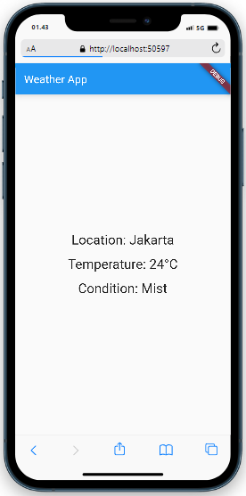

# Uas_Mobile
### Langkah-langkah
<p>1.Pastikan Anda telah menginstal Flutter dan mengatur proyek Flutter baru. Jika belum, Anda dapat mengunjungi situs resmi Flutter (https://flutter.dev) untuk informasi lebih lanjut.
<p></p>2.Buatlah sebuah file bernama weather_api.dart dan salin kode berikut ini:

```
import 'dart:convert';
import 'package:http/http.dart' as http;

class WeatherApi {
  final String apiKey;
  final String baseUrl = 'https://api.weatherapi.com/v1';

  WeatherApi(this.apiKey);

  Future<dynamic> getWeather(String city) async {
    final response = await http.get(Uri.parse('$baseUrl/current.json?key=$apiKey&q=$city'));
    
    if (response.statusCode == 200) {
      return jsonDecode(response.body);
    } else {
      throw Exception('Failed to get weather data');
    }
  }
}
```
3.Buatlah sebuah file bernama main.dart dan salin kode berikut ini:
```
import 'package:flutter/material.dart';
import 'weather_api.dart';

void main() {
  runApp(MyApp());
}

class MyApp extends StatelessWidget {
  final WeatherApi weatherApi = WeatherApi('db90a847b74d4ce2bc5182146230707'); // Ganti dengan API key Anda

  @override
  Widget build(BuildContext context) {
    return MaterialApp(
      title: 'Weather App',
      theme: ThemeData(
        primarySwatch: Colors.blue,
      ),
      home: WeatherScreen(api: weatherApi),
    );
  }
}

class WeatherScreen extends StatefulWidget {
  final WeatherApi api;

  const WeatherScreen({Key? key, required this.api}) : super(key: key);

  @override
  _WeatherScreenState createState() => _WeatherScreenState();
}

class _WeatherScreenState extends State<WeatherScreen> {
  String city = 'Jakarta'; // Ubah dengan kota yang Anda inginkan
  dynamic weatherData;

  @override
  void initState() {
    super.initState();
    fetchWeather();
  }

  void fetchWeather() async {
    try {
      final data = await widget.api.getWeather(city);
      setState(() {
        weatherData = data;
      });
    } catch (e) {
      print('Failed to fetch weather data: $e');
    }
  }

  @override
  Widget build(BuildContext context) {
    return Scaffold(
      appBar: AppBar(
        title: Text('Weather App'),
      ),
      body: Center(
        child: weatherData == null
            ? CircularProgressIndicator()
            : Column(
                mainAxisAlignment: MainAxisAlignment.center,
                children: <Widget>[
                  Text(
                    'Location: ${weatherData['location']['name']}',
                    style: TextStyle(fontSize: 24),
                  ),
                  SizedBox(height: 16),
                  Text(
                    'Temperature: ${weatherData['current']['temp_c']}°C',
                    style: TextStyle(fontSize: 24),
                  ),
                  SizedBox(height: 16),
                  Text(
                    'Condition: ${weatherData['current']['condition']['text']}',
                    style: TextStyle(fontSize: 24),
                  ),
                ],
              ),
      ),
    );
  }
}
```
4.Jalankan aplikasi dengan menjalankan perintah flutter run pada terminal di direktori proyek Anda.

### Outputnya

